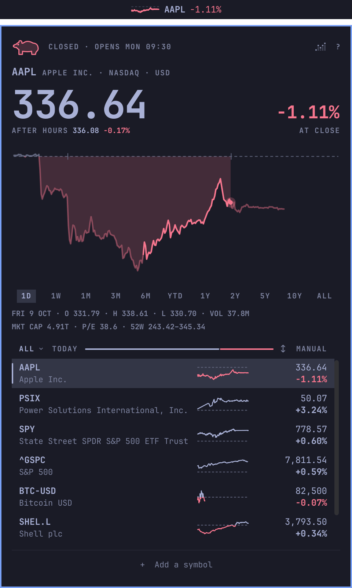
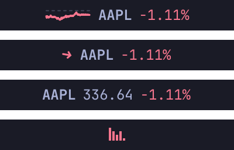
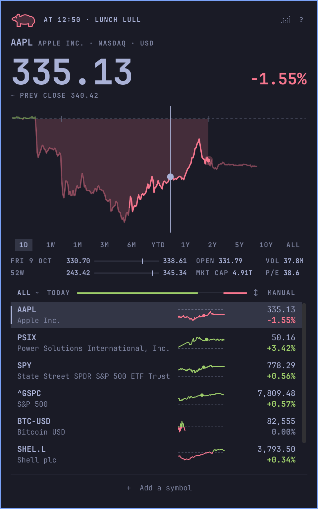
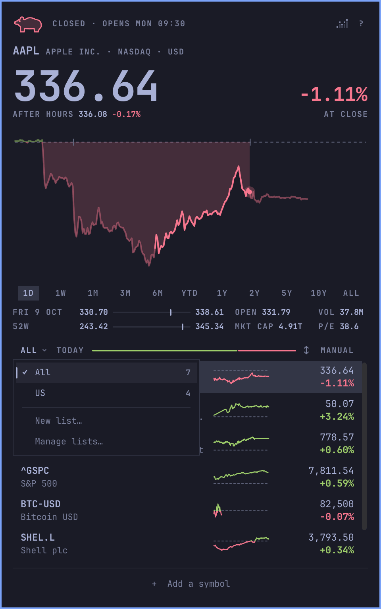
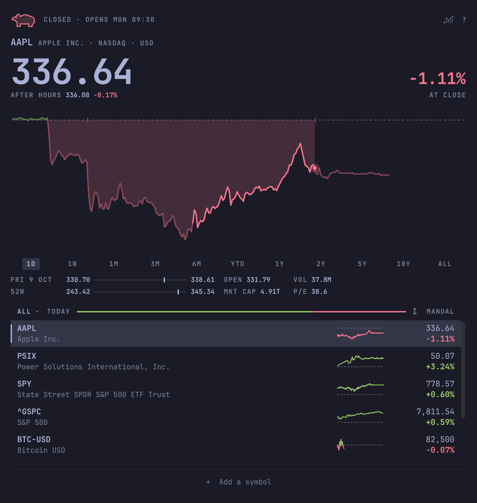
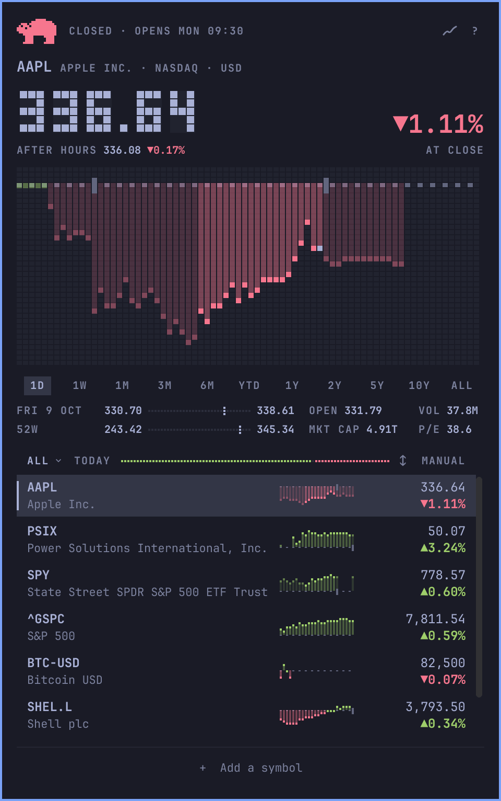

# Stonks

A stock watchlist plugin for the Omarchy 4 shell: today's move in your bar,
and a chart you can scrub a click away.

<p align="center">
  
</p>

- Today's move for a handful of stocks, in the bar.
- Click for the day's chart and scrub it with the pointer, or pick a range
  from a week to all time.
- Pre-market, after-hours, and overnight prices, and when the market opens
  or closes.
- Stocks, ETFs, indexes, crypto, and listings from London to Tokyo, each in
  its own currency.
- Lists of your own, such as a portfolio or a sector.
- No account and no API key.

## Install

Needs Omarchy 4.

```sh
omarchy plugin add https://github.com/gmchande/stonks.git --enable
```

The installer asks "Place grvc.stonks in which bar section?": `grvc.stonks`
is Stonks' id, and the pill starts in the section you pick, the centre by
default. To read the code before it runs, leave out `--enable`, then run
`omarchy plugin enable grvc.stonks`.

Optional: a key that opens and closes the window, in
`~/.config/hypr/bindings.lua`:

```lua
o.bind("SUPER + SHIFT + T", "Stonks", "omarchy-shell grvc.stonks toggleWindow")
```

Optional: Stonks in the app launcher, which `omarchy plugin add` doesn't set
up:

```sh
cp ~/.config/omarchy/plugins/grvc.stonks/share/stonks.desktop ~/.local/share/applications/
mkdir -p ~/.local/share/icons/hicolor/scalable/apps
cp ~/.config/omarchy/plugins/grvc.stonks/share/grvc.stonks.svg ~/.local/share/icons/hicolor/scalable/apps/
```

## The pill



The pill shows the day of the last stock you looked at; it can't be pinned
to one. Scroll over it to step through your list, left-click for the popup,
right-click for the window, and drag it to move it along the bar.

Middle-click changes its form: a sparkline, an arrow, the price as text, or
Stonks' mark, a little chart that climbs on an up day and falls on a down
one. In the bar's right section it starts as the mark and keeps a form of
its own.

## Reading the day



The top line says where the market is: counting down to the open or the
close, the lunch lull or the power hour, after hours, or closed until the
next open. Times are the exchange's own, with its zone named when it isn't
yours.

A smaller line under the price shows the pre-market, after-hours, or
overnight price. Overnight prices are for the US stocks and ETFs Robinhood
trades from 8 pm to 4 am New York time, Sunday to Thursday nights; their 1D
chart runs midnight to midnight.

Hover the chart to scrub back through the day: the price and the change
follow, and so do the rows, from the pre-market to the end of after hours.
Pick a range from 1D to All under the chart, or press `[` and `]`; one range
applies everywhere and is kept across restarts, and the rows stay on today.
`p` replays the chart.

Under the ranges, two lines show where the price sits in the day, or the
range, and in the past 52 weeks: the low, a tick at the price on a thin
rule, and the high. Beside them are the day's open and volume, or the dates
of the range's low and high, and the market cap and P/E. The cap is an
estimate: Yahoo's latest reported figure moved with the price since. A late
quote says so on its row and on the pill.

## Your lists



Press `a`, or click "+ Add a symbol", and type a name or a symbol. The top
result shows in the chart before you add it, and Enter adds it. Right-click
a row to remove it; `u`, or a click on the note in the footer, puts it back.

All holds every symbol you follow. Your own lists hold some of them, and a
symbol can be in several. Click the list's name, or press `w`, to switch
lists or start a new one, and `,` and `.` to step through them. `m` shows a
row's lists as tick boxes. Adding to a list adds to All too, and removing
from All removes the symbol everywhere.

The line beside the list's name shows how many rows are up, in green, and
down, in red. Click the order word, or press `o`, to sort by symbol, name,
or change, and Shift-click it to reverse the sort.

## The window



Right-click the pill, or run `omarchy-shell grvc.stonks openWindow '{}'`,
for Stonks in a tiled window that stays open while you work. It shares the
popup's lists, range, and quotes, and Escape closes it. Past 720 pixels its
content keeps that width and centres. To float it, match class
`org.quickshell` and title `Stonks` in a window rule.

The window also works with no pill. Run
`omarchy plugin disable grvc.stonks`, then add `{ "id": "grvc.stonks" }` to
`plugins` in `~/.config/omarchy/shell.json` to keep the plugin loaded. To
bring the pill back, remove that entry first, then run
`omarchy plugin enable grvc.stonks center`.

## Smooth or retro



Press `s`, or click the small chart icon at the top right, to switch from
smooth to retro, which draws the way Omarchy draws its logo. Up is the
theme's green and down its red, or the plain text colour where the two are
too close to tell apart.

## Keys

`?` opens a sheet of the everyday keys. Every key is in this table:

| Key | Does |
| --- | --- |
| `↑` `↓` | Move the row cursor |
| `j` `k` | Move the row cursor (popup) |
| `⏎` | Feature the cursor row |
| Space | Feature the cursor row (popup) |
| `←` `→` | Scrub one chart step |
| `h` `l` | Scrub one chart step (popup) |
| `[` `]` | Change the chart range |
| `p` | Replay the shown chart |
| `Shift+P` | Replay it in slow motion |
| `a` or `+` | Search and add a symbol |
| `x` | Remove the cursor row |
| `u` | Undo the last removal, until the lists next change |
| Delete or Backspace | Remove the cursor row (window) |
| `Shift+J` `Shift+K` | Reorder the cursor row (manual order only) |
| `o` | Cycle the list order |
| `Shift+O` | Reverse a sorted order (or Shift-click the order) |
| `w` | Open the list menu |
| `Shift+W` | Manage lists: rename, reorder, delete |
| `m` | The cursor row's lists |
| `,` `.` | Previous or next list, scrolled where you left it |
| `c` | Cycle the day's change: percent, amount, and since-open |
| `s` | Switch between the smooth and retro looks |
| `r` | Refresh |
| `1` to `9` | Feature that row |
| Tab or `Shift+Tab` | Next panel on the bar (popup) |
| `?` | Open the shortcut sheet |
| `Esc` | Close the sheet, then the scrub, then the popup or window |

## What it runs

- **Commands:** `curl` for every request, and `omarchy restart shell` only
  when you click the update notice.
- **Hosts:** `query1.finance.yahoo.com` for quotes, charts, and the cap and
  P/E; `query2.finance.yahoo.com` for search; and `api.robinhood.com` for
  overnight prices and which stocks trade overnight. Nothing else.
- **Files it writes:** your lists and settings in
  `~/.config/omarchy/grvc.stonks.json`, and the last quotes in
  `~/.cache/grvc.stonks/quotes.json`. The shell keeps the pill's form on its
  bar entry in `~/.config/omarchy/shell.json`.
- **Limits:** 5 seconds to connect and 10 for each answer, which is capped
  at 64 KB, 256 KB for a range, and 16 KB plus 80 KB a stock for Robinhood.
  Each listing is asked for only as often as its market can move, and a
  host that refuses is left alone for a while.
- **Updates:** never by itself.

Every request runs through the one curl command in [`Fetch.js`](Fetch.js).
[`test/boundaries.sh`](test/boundaries.sh) fails if a command, a file read
or write, or a request turns up outside the few files allowed them.

## Update

```sh
omarchy plugin update grvc.stonks
```

The shell runs the old version until it restarts: click the popup's
"Updated to … · restart the shell", or run `omarchy restart shell`.

## Remove

```sh
omarchy plugin remove grvc.stonks
rm ~/.config/omarchy/grvc.stonks.json      # your lists; keep it to reinstall later
rm -r ~/.cache/grvc.stonks
rm -f ~/.local/share/applications/stonks.desktop ~/.local/share/icons/hicolor/scalable/apps/grvc.stonks.svg
```

Then delete the `o.bind` line if you added one.

## Data

Quotes, charts, search, and the cap and P/E come from Yahoo Finance's
endpoints, which are unofficial: Yahoo doesn't offer them for this use, and
its terms restrict automated access. Overnight prices come from Robinhood's
public data, which is for personal use. Neither asks for an account or a
key, and either may change or stop without notice. Prices show in each
listing's own currency; Stonks never converts them.

Code: MIT, see [LICENSE](LICENSE).

## Contributing

How Stonks is built, how to run your checkout, the checks, and how to send a
change are in [CONTRIBUTING.md](CONTRIBUTING.md).
